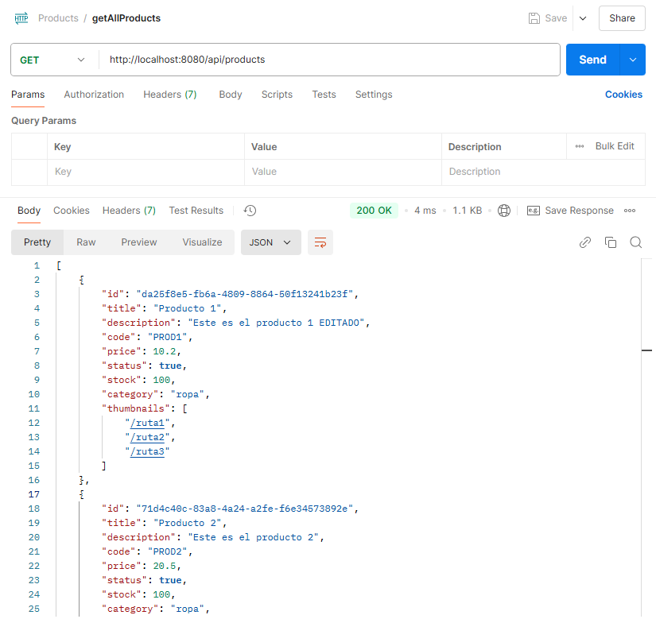
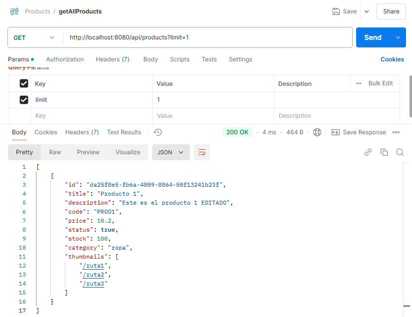
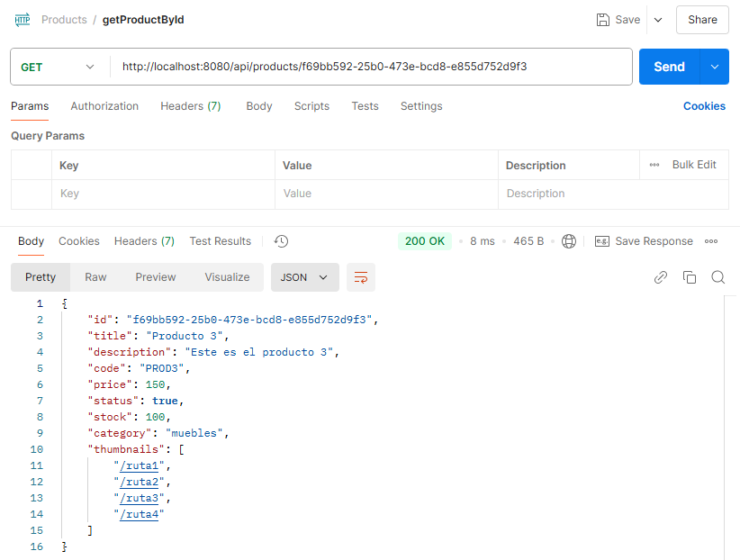
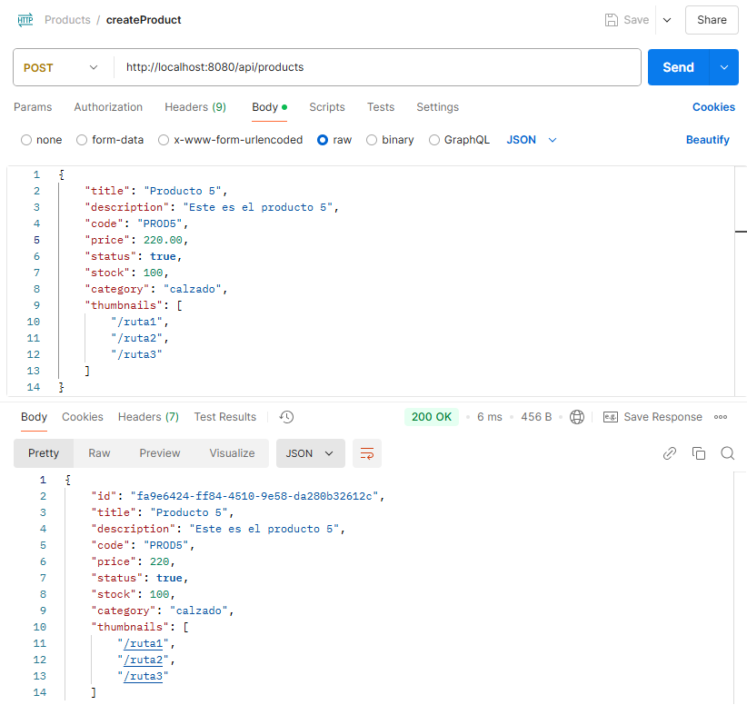
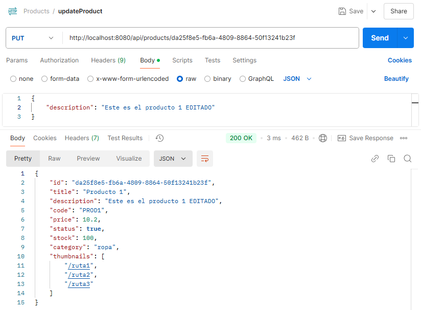
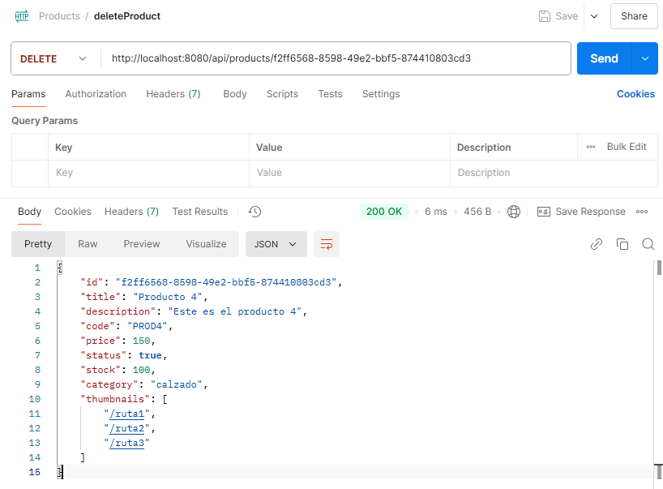
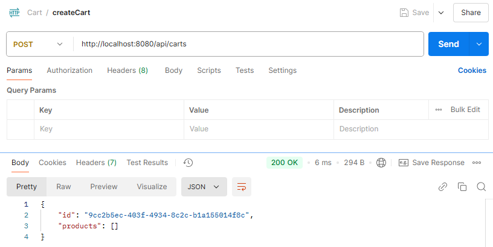
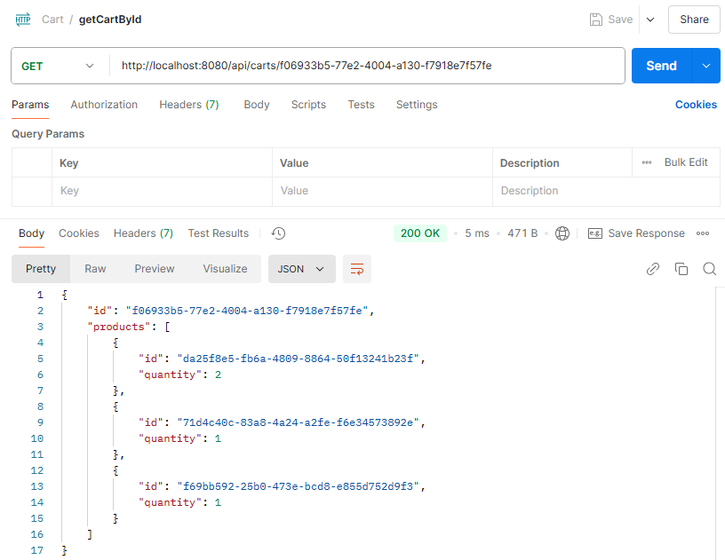
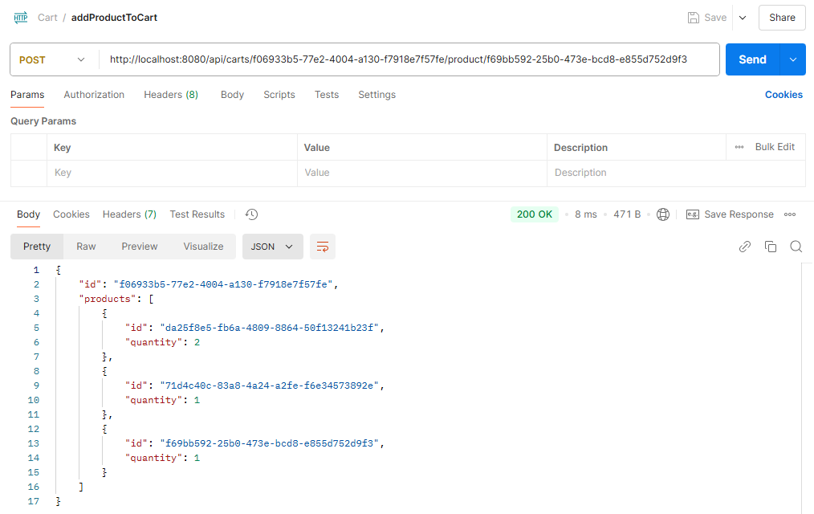

# 🛒 Product & Cart API

Este proyecto es una API RESTful desarrollada en Node.js con Express que permite gestionar productos y carritos de compras. La API escucha en el puerto 8080 y dispone de rutas organizadas por grupos para manejar productos y carritos.

## 📝 Descripción

La API proporciona un conjunto de funcionalidades para manejar productos y carritos, incluyendo la creación, listado, actualización y eliminación de productos, así como la gestión de carritos y la adición de productos a estos.

## ✅ Funcionalidades

#### Rutas de Productos (/api/products/):

- **GET /**: Lista todos los productos disponibles, con la opción de limitar la cantidad mostrada usando el query parameter `?limit`.
- **GET /:pid**: Devuelve los detalles de un producto específico por su ID.
- **POST /**: Agrega un nuevo producto a la base de datos.
- **PUT /:pid**: Actualiza los datos de un producto específico, sin modificar su ID.
- **DELETE /:pid**: Elimina un producto específico por su ID.

#### Rutas de Carritos (/api/carts/):

- **POST /**: Crea un nuevo carrito vacío.
- **GET /:cid**: Lista los productos contenidos en un carrito específico.
- **POST /:cid/product/:pid**: Agrega un producto al carrito, incrementando su cantidad si ya existe.

## 💡 Tecnologías utilizadas

- **Backend**: Node.js, Express
- **Base de Datos**: Sistema de archivos (fs/promises)
- **Lenguajes**: JavaScript
- **Herramientas de Desarrollo**: Postman, Git, Visual Studio Code

## 🔨 Instalación

1. Clona el repositorio:

```bash
 git clone https://github.com/GwynethS/ProgramacionBackend1-PF.git
```

2. Navega al directorio del proyecto:

```bash
   cd nombre-del-proyecto
```

3. Instala las dependencias:

```bash
   npm install
```

4. Ejecuta el servidor:

```bash
   npm start
```

La API estará disponible en `http://localhost:8080`.

## 📝 Pruebas de Endpoints

1. **Listar todos los productos**

   - **Endpoint**:`GET /api/products`

  <p align="center">
    
  </p>

2. **Listar todos los productos (LIMIT)**

   - **Endpoint**:`GET /api/products`

  <p align="center">
    
  </p>

<br>

3. **Listar producto por ID**

   - **Endpoint**:`GET /api/products/:pid`

  <p align="center">
    
  </p>

<br>

4.  **Crear un producto**

    - **Endpoint**:`POST /api/products`
    
    - **Body**:
    
    ```
      {
        "title": "Producto 5",
        "description": "Este es el producto 5",
        "code": "PROD5",
        "price": 220.00,
        "status": true,
        "stock": 100,
        "category": "calzado",
        "thumbnails": [
            "/ruta1",
            "/ruta2",
            "/ruta3"
        ]
      }
    ```

  <p align="center">
    
  </p>

<br>

5. **Actualizar un producto**

   - **Endpoint**: `PUT /api/products/:pid`

   - **Body**:

   ```
     {
       "description": "Este es el producto 1 EDITADO"
     }
   ```

  <p align="center">
    
  </p>
      <br>

6. **Eliminar un producto**

   - **Endpoint**: `DELETE /api/products/:pid`

  <p align="center">
    
  </p>

<br>

7. **Crear un carrito**

   - **Endpoint**: `POST /api/carts`

  <p align="center">
    
  </p>
<br>

8. **Listar productos en un carrito**

   - **Endpoint**: `GET /api/carts/:cid`

  <p align="center">
    
  </p>

<br>

9. **Agregar producto al carrito**

   - **Endpoint**: `POST /api/carts/:cid/product/:pid`

  <p align="center">
    
  </p>
